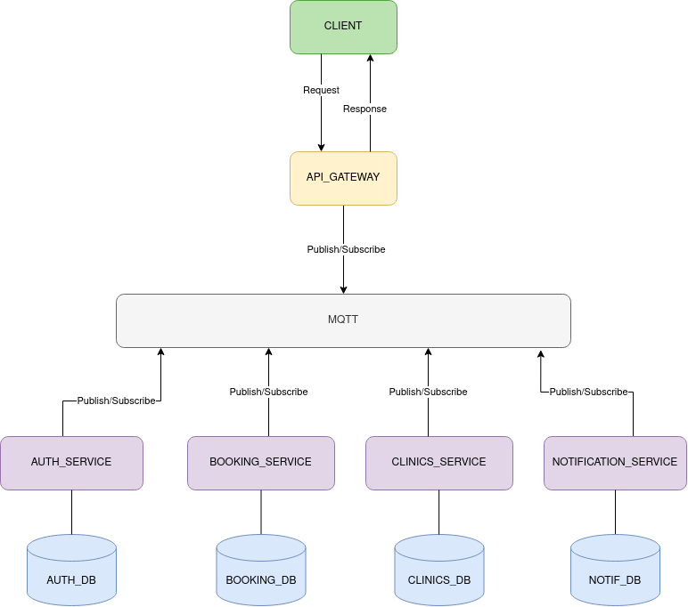
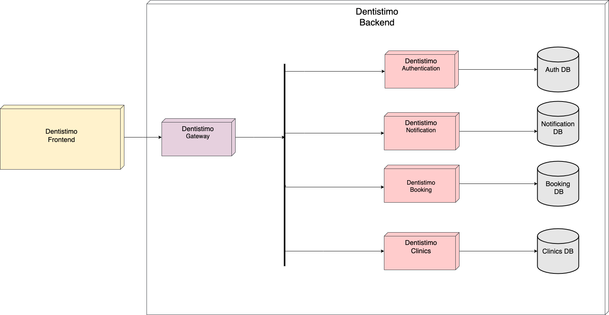
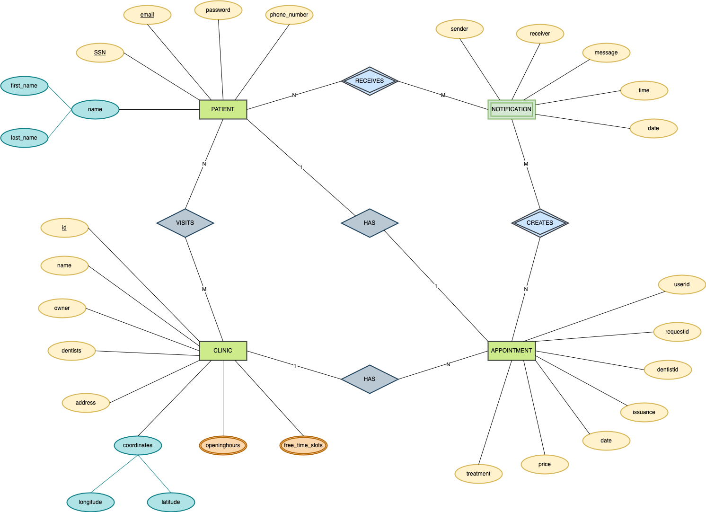
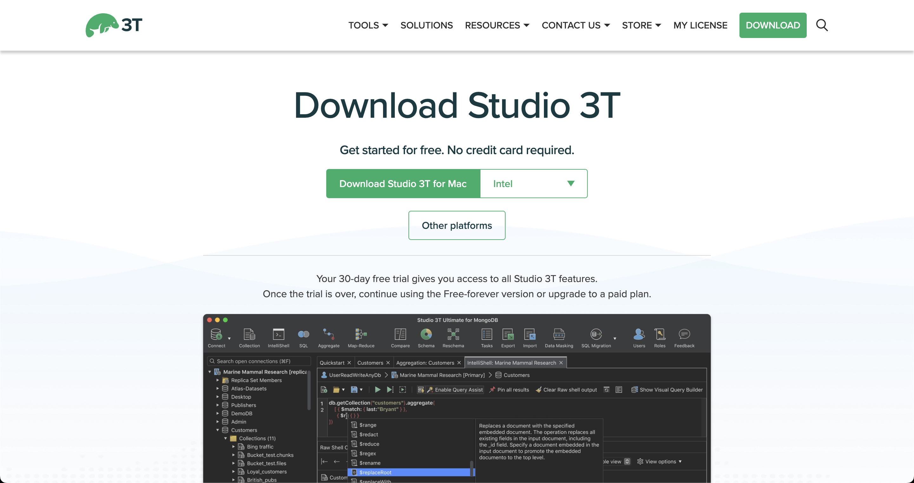
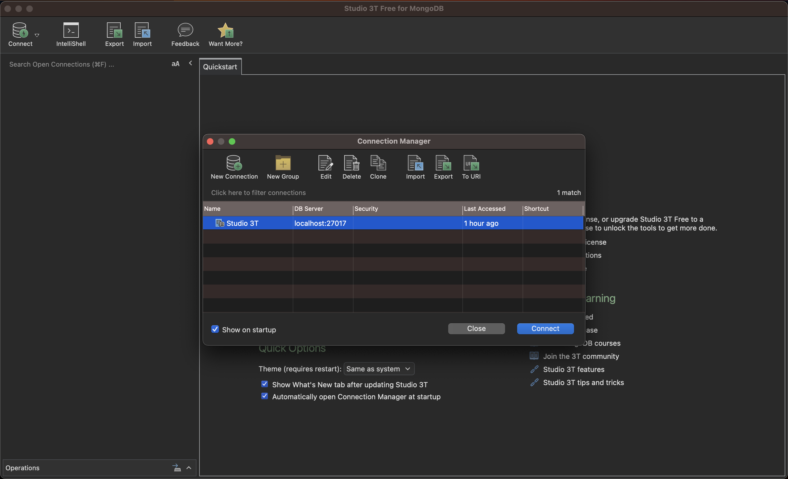
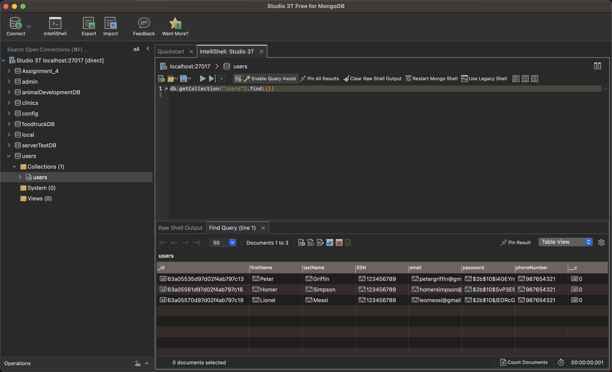

# T1-Project Documentation

# Purpose (Conny)
 - Team members Roles, and Tasks,  
 - Links to all relevant related team resources (Trello board, source-code repositories etc.) 

# Software Requirement Specification (SRS): (Labi and Victor)
 - focus on proper (SMART) phrasing of requirements 
 - requirements shall have unique ID’s 
 - team requirements logically 

# Software Architecture Document (SAD): (Shariq, Alaa & Umar)

 - **Description of the conceptual design  of  the  architecture; including architectural styles**

 - **How the conceptual design is mapped onto implementation/technologies.**
  
  #### Service-oriented Architecture (SOA)

  
  

  #### Deployment Diagram

  

  **Identify, state and justify any architecture design decisions or tactics used:**

   - To improve fault tolerance for the distributed system as a whole, we implemented a set standard for error communication between the components, the standard is known as MQTTErrorException in code and is used to effectively and reliably transfer errors from the service layer to the client. 

   - To improve the security of our application, we limit the access of unauthenticated users, the authentication is implemented using a token based approach by making use of JSON Web Tokens.

   - Although MQTT is the main protocol for inter-service communication, to allow frontend clients to interact with applications, we use the traditional Client/Server approach over HTTP. This means that the clients never interact with the broker, providing an extra layer of security from attacks such as DOS, DDOS and Fingerprinting among others. Although this adds further complexity for implementing reactive components, the benefits outweigh the disadvantages, and alternatives such as (SSEs and websockets are available for reactive applications).

   - We use an API gateway which is the entry point into the backend system, this component is responsible for properly forwarding client requests and returning service responses back to the client. This is also where a circuit breaker is implemented so that the application can react to failures in an efficient manner, improving performance and reliability.

# Program Management Report (PMR)

## Description of the Project Management Practices
### The Scrum Methodology
Our team chose to implement the Scrum methodology for this project. This included conducting sprint planning, sprint reviews, sprint retrospectives, using a Kanban board for task management, and holding daily standups. The team also rotated members in the roles of Scrum Master, Product Owner, and Developers. The decision was made due to the benefits provided by an agile process model, as well as the team’s overall familiarity with the model. User Story Practice is the chosen form of task definition within our team, this was mainly because the requirements provided by the product owners are in user story form. Continuous Delivery (CD) is a core practice within the team, this is emphasized by the use of an agile process model such as Scrum. The sprint based workflow inherently supports Continuous Delivery (CD), hence its use in the project.

### Spring Planning
The sprint planning consists of a meeting between the team Scrum Master and the members of the team. The agenda of the meeting contains but is not limited to, the optimization of user stories (i.e breaking them down into smaller stories), cost and time estimations for the user stories, as well as the distribution and assignment of tasks. The meeting, ideally, should output an updated sprint backlog with structured user stories that are estimated and distributed among the members of the team.

### Sprint Review
This meeting is held at the end of the sprint, where the team presents what was accomplished during this sprint and decides whether the goal of this sprint was achieved. If the goal was not achieved then the unfinished items were moved back to the Product Backlog, waiting for future assessment for one of the upcoming sprints.

### Sprint Retrospective
At the end of each sprint, when the sprint review was done, the scrum team carries out a sprint retrospective. Sprint retrospective is a discussion between team members regarding questions such as “what went well?”, “what can we improve?”, and “what should we start, stop or continue doing?”. After the meeting, the whole team receives a filtered version of good practices and activities that the team can apply in the next sprint. The goal behind is to have a more successful sprint than the previous one.

### Kanban for User Stories and Task Management
The Product Owner and the Scrum Master had the overall responsibility of the Kanban board on Trello, making sure we meet the traceability requirements and keeping the tool updated in relation to the current status of the project. Every sprint we would rotate these roles so that everyone had the opportunity to step into a new role and learn about the position. User stories enabled us to keep track of work progress and who was assigned to what task. We followed the template of <As a [type of user], I want to [perform some task] so that I can [achieve some goal]>. Additionally, we used Kanban for handling other project related tasks that were not user stories. 

To successfully implement product and sprint backlogs, we followed several steps. First, we identified and documented all the necessary tasks in the product backlog. This included breaking down large tasks into smaller, more manageable pieces. Next, the team prioritized the tasks in the product backlog based on their importance and the dependencies between them. Then, we selected a set of tasks from the product backlog to be completed during the current sprint and added these to the sprint backlog. We also made sure to regularly review and update both the product and sprint backlogs to reflect changes in priorities and completed tasks. By following these steps, we were able to effectively organize and manage our work, ensuring that the necessary tasks were completed in a timely and efficient manner.

### Daily Standups
Whether it was on campus or remotely via Discord, we held regular daily standups where each team member would answer the following three questions: “what did you work on yesterday?”, “what are you working on today?” and “do you have any impediments you would like to address?”. It was the Scrum Master’s responsibility to moderate the daily standups to facilitate collaboration between developers by identifying possible synergies during the daily scrum. Also, the scrum master’s job was to take care of any obstacles that are not directly related to development.

## Important project management decisions regarding schedule and scope.
There were several important project management decisions made regarding the schedule and scope of the project. First, the team decided to have sprint planning meetings every Wednesday afternoon in each sprint. This allowed us to regularly review and plan the work that needed to be completed in the upcoming sprint, ensuring that we were able to stay on track and meet our deadlines. Additionally, we decided to have sprint review and retrospective meetings on Mondays. These meetings provided an opportunity for us to review the work completed in the previous sprint, as well as reflect on what went well and what could be improved. Both of these meetings were limited to a maximum of 2 hours, which helped to ensure that we remained focused and efficient. By keeping the meetings short and to the point, we were able to stay on track and avoid wasting time. Finally, we made the decision to stick with the original scope of the project and not change it. This allowed us to maintain our focus and avoid the distractions and delays that can often be caused by scope changes. By effectively managing our time and resources, we were able to successfully implement our work within the original scope of the project.

# Architecture (This will fall under SAD)

## Architectural Significant Requirements
Concurrency – The system should not allow concurrent bookings. That means, if
two or more users make bookings at the same clinic, to the same dentist at the same
time, the system will be able to handle it in a proper way. Meaning one user should
receive a confirmation and the other a rejection.

Resilience to failure – Solid error handling for all entry points into the system is an
important consideration for the system as it is trusted to handle data from the general
public by the government.

Openness – The system should be open to new features since we know that new
requirements will be added in the project.

Security – The system shouldn’t allow users to access unauthorized accounts or
change other users' booking.

Transparency – The system should seem to be like a single, coherent entity for one
user rather than individual components.

## Functional Decomposition Model (FDM)

*Figure - The purpose of a functional decomposition model is to break down a system into its smaller components of functions. Our FDM can be read from left to right in a chronological order, from the point of when a user registers a new account to notification of a successful appointment booking.*

## Service-oriented Architecture (SOA)

*Figure - placeholder*

## Entity Relationship (ER) Diagram

*Figure - The ER diagram represents the system's database by illustrating the entities and their relationship. Each of the four entities above represent the 4 different backend services that are implemented in their corresponding repo on GitLab. Respectively, each service is connected to its own database in order to fulfull the requirement of service-oriented architecture (SOA) style.*

## Design decision tamplate

## Sitemap

*Figure - The Sitemap diagram represents all the pages in our application and shows the inter-connection between them. It also shows how the navigation takes place from one page to the other.*

## Visuals (Victor if time)

Depending on what you are making, it can be a good idea to include screenshots or even a video (you'll frequently see GIFs rather than actual videos). Tools like ttygif can help, but check out Asciinema for a more sophisticated method.

# Installation instructions (instructions for adding node.js, yarn and mongo)

## MongoDB and Studio 3T

### 1. Check that you have mongo version ≥ 5, by running ’mongosh’ in your terminal. Install or update if you don't have mongo version 5 or above. Installation instructions for various different OS's can be found here: https://www.mongodb.com/docs/manual/installation/.

### 2. Download and install Studio 3T from https://studio3t.com/download/. Studio 3T is a GUI that enables easier interaction between the user and the database.

### 3. Open Studio 3T and create a new connection if not already existing. This new connection is part of the setup where you declare through which URI your database and your backend service is communication through.

### 4. Create the new connection by importing your URI ('mongodb://localhost:27017' for example in this project) with Connection Manager.

### 5. Click ’save’ and then click ’connect’.

### 6. Test your mongoDB connection and configuration by running one of your services through MQTT. Below follows an example from one of our sevices that creates a user in the DB when the user signs up on our web page.

# The Team

- Armin Balesic gusbalar@student.gu.se
- Victor Campanello guscampvi@student.gu.se
- Labiba Karar Eshaba guseshka@student.gu.se
- Conny Luong gusluoco@student.gu.se
- Umar Mahmood gusmahum@student.gu.se
- Shariq Shahbaz gusshahbsh@student.gu.se
- Alaa Taleb gustalebal@student.gu.se

# License

MIT License

Copyright (c) 2023 DENTISTIMO

Permission is hereby granted, free of charge, to any person obtaining a copy of this software and associated documentation files (the "Software"), to deal in the Software without restriction, including without limitation the rights to use, copy, modify, merge, publish, distribute, sublicense, and/or sell copies of the Software, and to permit persons to whom the Software is furnished to do so, subject to the following conditions:

The above copyright notice and this permission notice shall be included in all copies or substantial portions of the Software.

THE SOFTWARE IS PROVIDED "AS IS", WITHOUT WARRANTY OF ANY KIND, EXPRESS OR IMPLIED, INCLUDING BUT NOT LIMITED TO THE WARRANTIES OF MERCHANTABILITY, FITNESS FOR A PARTICULAR PURPOSE AND NONINFRINGEMENT. IN NO EVENT SHALL THE AUTHORS OR COPYRIGHT HOLDERS BE LIABLE FOR ANY CLAIM, DAMAGES OR OTHER LIABILITY, WHETHER IN AN ACTION OF CONTRACT, TORT OR OTHERWISE, ARISING FROM, OUT OF OR IN CONNECTION WITH THE SOFTWARE OR THE USE OR OTHER DEALINGS IN THE SOFTWARE.
